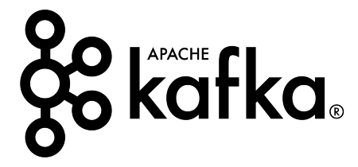

Apache Kafka
------

The Open Data Hub is a reference architecture running on OpenShift that incorporates a variety of open source projects to function as an ML-as-a-service platform. Given the huge amounts of data to be ingested and processed, it's crucial to have a reliable streaming platform. To solve this problem we use Apache Kafka.

Apache Kafka is an open-source stream-processing software platform. It is used for building real-time data pipelines and streaming apps. It is horizontally scalable, fault-tolerant, wicked fast, and runs in production in thousands of companies.

Apache Kafka is a distributed streaming platform. What exactly does that mean?
A streaming platform has three key capabilities:

1) Publish and subscribe to streams of records, similar to a message queue or enterprise messaging system.
2) Store streams of records in a fault-tolerant durable way.
3) Process streams of records as they occur.

Kafka is generally used for two broad classes of applications:

Building real-time streaming data pipelines that reliably get data between systems or applications
Building real-time streaming applications that transform or react to the streams of data

Strimzi Operator
------

[Strimzi](https://strimzi.io/) is based on Apache Kafka, a popular platform for streaming data delivery and processing. Strimzi makes it easy to run Apache Kafka on Kubernetes.

Strimzi provides three operators:

1) Cluster Operator
Responsible for deploying and managing Apache Kafka clusters running on a Kubernetes cluster.

2) Topic Operator
Responsible for managing Kafka topics within a Kafka cluster running on a Kubernetes cluster.

3) User Operator
Responsible for managing Kafka users within a Kafka cluster running on a Kubernetes cluster.

Monitoring
------

Kafka deployed usind ODH Operator comes pre-configured to expose metrics out of the box which are scraped using Prometheus and Visualized using Grafana. This gives us a holistic view of the Kafka cluster's health and performance.

Sample Use Cases
------

1) Data Ingestion: Internally we have a Kafka deployment for ingesting data and back it up to Elasticsearch and Ceph S3 for analysis using Logstash and s3 Connector. We have 3 Kafka and 3 zookeeper Brokers of 10 Tb each backed by Persistent Volumes with a peak throughput of around 20k messages per second and a sustained rate of ~12k messages per second.

2) Data Streaming: For credit monitoring we have a kafka deployment which ingests credit data as a producer in near-real time and are consumed and sent to the seldon model-serving layer for risk monitoring and fraud detection.
